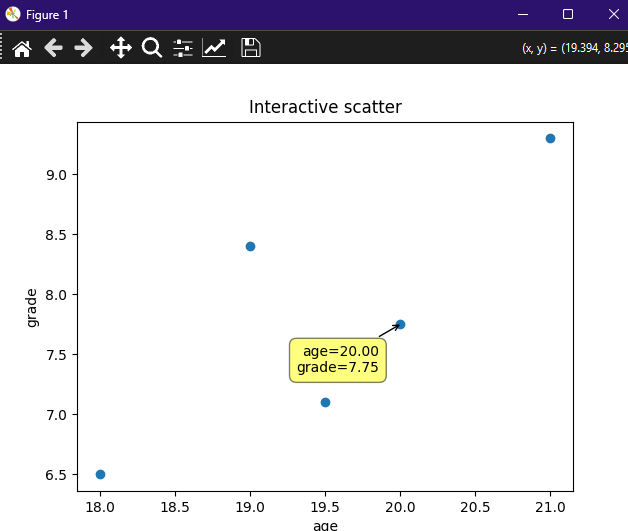
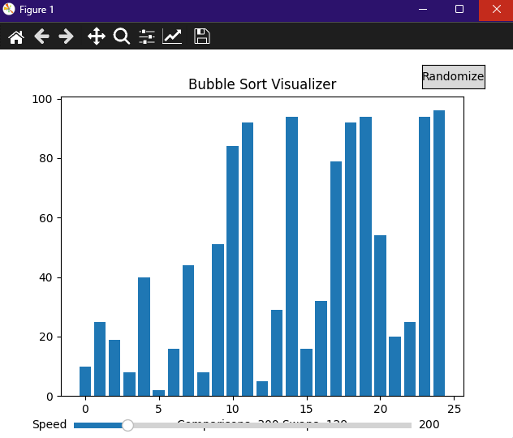
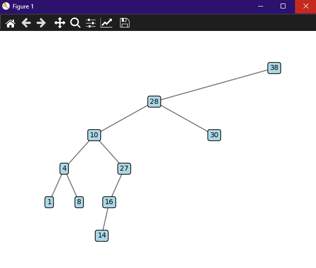

# Interactive Data Viz

A single repository that combines a reproducible data cleaning pipeline, interactive analytics,
and algorithm visualizations.

[](https://github.com/teogame3d-alt/interactive-data-viz/actions/workflows/ci.yml)





## Problem
Data projects often lack a reproducible path from raw inputs to trustworthy visuals.

## Solution
An ETL-style cleaning pipeline with data contracts and reporting, plus interactive plots and
algorithm visualizers that make results inspectable.

## Tech
Python, pandas, NumPy, matplotlib, mplcursors, pytest, GitHub Actions.

## Impact
- Reproducible cleaning with validation
- Interactive analysis with cursor inspection
- Visual explanation of algorithm behavior

## Engineering Focus
- Data contracts and validation before visualization
- Separated modules for ETL, analytics, and algorithms
- Test coverage for both pipeline and algorithm logic

## Quick Start
```bash
python -m venv .venv
.venv\Scripts\python -m pip install -U pip
.venv\Scripts\python -m pip install -e .[dev]
.venv\Scripts\python -m interactive_data_viz
```

## Modules
- `cleaning_pipeline/`: load, validate, clean, report
- `viz/`: interactive plots + algorithm visualizations
- `algorithms/`: sorting + BST + metrics

## Demo (Employer)
1. Run the app to generate the cleaning report and open the interactive charts.
2. Explore a chart point with the cursor to show exact values.
3. Open the algorithm visualizer and compare metrics.

## Tests
```bash
.venv\Scripts\python -m pytest
```

## Design Decisions
See `docs/DECISIONS.md`.

## Data
- `data/demo_students.csv` contains synthetic demo records (no real personal data).
