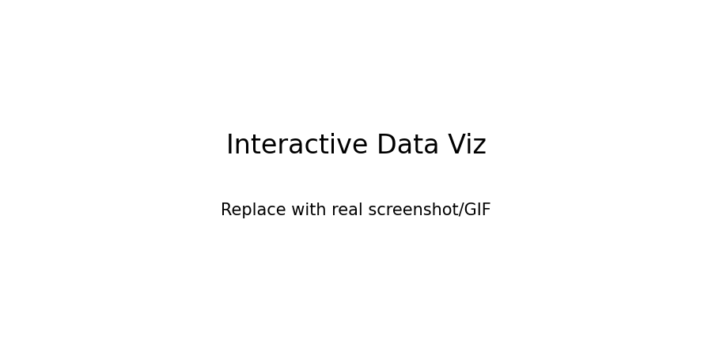

# Interactive Data Viz

A single repository that combines:
1) A reproducible data cleaning pipeline (ETL-style with data contracts)
2) Interactive analytics and charts with mplcursors
3) Algorithm visualizations (sorting + BST)



## Quick Start
```bash
python -m venv .venv
.venv\Scripts\python -m pip install -U pip
.venv\Scripts\python -m pip install -e .[dev]
.venv\Scripts\python -m interactive_data_viz
```

## Modules
- `cleaning_pipeline/`: load, validate, clean, report
- `viz/`: interactive plots + algorithm visualizations
- `algorithms/`: sorting + BST + metrics

## Tests
```bash
.venv\Scripts\python -m pytest
```

## Design Decisions
See `docs/DECISIONS.md`.

## Hiring Checklist
- Data contract validation + cleaning pipeline
- Automatic report generation (markdown + chart)
- Interactive plots with cursor inspection
- Algorithm visualizer with metrics
